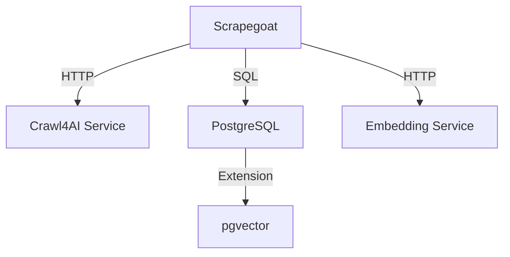

# Technical Requirements

**Last Updated:** 2025-11-08

This document outlines the technical requirements for integrating Crawl4AI into the Scrapegoat storage pipeline.

---

## Functional Requirements

### FR-1: Crawl4AI Fetcher Selection

**Requirement:** System must allow users to select Crawl4AI as the content fetcher for scraping jobs.

**Acceptance Criteria:**
- [ ] User can set `useCrawl4AI: true` in scraping request
- [ ] When flag is true, Crawl4AIFetcher is used instead of HttpFetcher
- [ ] When flag is false or omitted, standard fetcher selection logic applies
- [ ] Flag propagates through entire scraping pipeline

**Priority:** 🔴 Critical

### FR-2: Content Storage in PostgreSQL

**Requirement:** Content fetched by Crawl4AI must be stored in PostgreSQL database.

**Acceptance Criteria:**
- [ ] Markdown content from Crawl4AI is stored in `documents` table
- [ ] Page metadata is stored in `pages` table with `content_type: "text/markdown"`
- [ ] Library and version information stored in `libraries` and `versions` tables
- [ ] No data loss or corruption during storage

**Priority:** 🔴 Critical

### FR-3: Vector Embeddings Generation

**Requirement:** Content chunks must be embedded and stored in pgvector format.

**Acceptance Criteria:**
- [ ] Markdown content is split into semantic chunks
- [ ] Each chunk receives a vector embedding (1536 dimensions)
- [ ] Embeddings are stored in `documents.embedding` column
- [ ] Embeddings are generated using configured embedding service (OpenAI/Ollama/Infinity)

**Priority:** 🔴 Critical

### FR-4: Configuration Persistence

**Requirement:** Scraper configuration including `useCrawl4AI` flag must be stored for reproducibility.

**Acceptance Criteria:**
- [ ] `useCrawl4AI` flag is stored in `versions.scraper_options` JSON field
- [ ] Can query database to find which versions used Crawl4AI
- [ ] Stored configuration includes all relevant scraping options
- [ ] Configuration is retrievable for re-indexing

**Priority:** 🔴 Critical

### FR-5: Hybrid Search Capability

**Requirement:** Stored content must be searchable using hybrid search (vector + FTS).

**Acceptance Criteria:**
- [ ] Can search Crawl4AI content using vector similarity
- [ ] Can search Crawl4AI content using full-text search
- [ ] Results combine both search methods using RRF
- [ ] Search results include proper metadata (URL, title, content type)

**Priority:** 🔴 Critical

### FR-6: Error Handling

**Requirement:** System must gracefully handle Crawl4AI service failures.

**Acceptance Criteria:**
- [ ] Clear error message when Crawl4AI service is unavailable
- [ ] Circuit breaker prevents cascading failures
- [ ] Job marked as FAILED with descriptive error message
- [ ] Error messages guide user to resolution steps

**Priority:** 🔴 Critical

### FR-7: Backward Compatibility

**Requirement:** Existing scraping workflows must continue to work unchanged.

**Acceptance Criteria:**
- [ ] Scraping without `useCrawl4AI` flag works as before
- [ ] Existing tests pass without modification
- [ ] No breaking changes to public APIs
- [ ] Default behavior unchanged (useCrawl4AI defaults to false)

**Priority:** 🔴 Critical

---

## Non-Functional Requirements

### NFR-1: Performance

**Requirement:** Crawl4AI integration must not degrade performance for standard scraping.

**Acceptance Criteria:**
- [ ] Standard HTTP scraping performance unchanged
- [ ] Crawl4AI scraping completes within acceptable timeframe (2-5x slower than HTTP)
- [ ] No memory leaks or resource exhaustion
- [ ] Database queries remain performant with Crawl4AI content

**Metrics:**
- Standard HTTP fetch: < 1s per page
- Crawl4AI fetch: < 5s per page
- Database insert: < 100ms per chunk
- Embedding generation: < 500ms per chunk batch

**Priority:** 🟡 Important

### NFR-2: Reliability

**Requirement:** Integration must be reliable and resilient to failures.

**Acceptance Criteria:**
- [ ] Circuit breaker prevents repeated failures
- [ ] Retry logic handles transient errors
- [ ] Service unavailability doesn't crash system
- [ ] Data consistency maintained across failures

**Metrics:**
- Circuit breaker opens after 5 consecutive failures
- Circuit breaker half-open timeout: 60s
- Maximum retries: 3
- Exponential backoff: 1s, 2s, 4s

**Priority:** 🔴 Critical

### NFR-3: Scalability

**Requirement:** Solution must scale with increased Crawl4AI usage.

**Acceptance Criteria:**
- [ ] Multiple concurrent Crawl4AI requests supported
- [ ] Database handles increased storage from markdown content
- [ ] Embedding generation scales with batch processing
- [ ] No bottlenecks introduced

**Metrics:**
- Support 3-5 concurrent Crawl4AI requests
- Database can store 100k+ markdown chunks
- Embedding batch size: 100 documents
- pgvector index performance maintained

**Priority:** 🟡 Important

### NFR-4: Maintainability

**Requirement:** Code must be maintainable and well-documented.

**Acceptance Criteria:**
- [ ] Code follows project conventions
- [ ] JSDoc comments for all public APIs
- [ ] Clear separation of concerns
- [ ] Integration points well-documented

**Metrics:**
- Code coverage: >80%
- All public APIs documented
- No complex functions (cyclomatic complexity < 10)

**Priority:** 🟡 Important

### NFR-5: Testability

**Requirement:** All components must be testable in isolation and integration.

**Acceptance Criteria:**
- [ ] Unit tests for fetcher selection logic
- [ ] Integration tests for full pipeline
- [ ] Test doubles available for Crawl4AI service
- [ ] Tests can run without external dependencies

**Metrics:**
- Unit test coverage: >85%
- Integration test coverage: >70%
- All critical paths tested

**Priority:** 🟡 Important

### NFR-6: Security

**Requirement:** No security regressions introduced.

**Acceptance Criteria:**
- [ ] No sensitive data logged
- [ ] Crawl4AI service communication over HTTP (localhost only)
- [ ] No SQL injection vulnerabilities
- [ ] Input validation for all user-provided data

**Priority:** 🔴 Critical

### NFR-7: Observability

**Requirement:** System behavior must be observable and debuggable.

**Acceptance Criteria:**
- [ ] Clear log messages for fetcher selection
- [ ] Metrics for Crawl4AI usage
- [ ] Error tracking for failures
- [ ] Database queries trackable

**Metrics:**
- Log level: DEBUG for fetcher selection
- Track: Crawl4AI requests, successes, failures
- Monitor: Circuit breaker state changes

**Priority:** 🟡 Important

---

## Technical Constraints

### TC-1: Database Schema

**Constraint:** No database schema migrations allowed in Phase 1.3.

**Rationale:** Minimize deployment complexity and risk.

**Impact:**
- Must use existing `scraper_options` JSON field
- Must use existing `content_type` field for tracking
- No new columns can be added

**Mitigation:** Existing schema is sufficient for requirements.

### TC-2: Backward Compatibility

**Constraint:** No breaking changes to existing APIs.

**Rationale:** Existing integrations and workflows must continue to function.

**Impact:**
- New fields must be optional
- Default behavior must be unchanged
- Existing tests must pass without modification

**Mitigation:** Feature flag approach with defaults ensures compatibility.

### TC-3: Crawl4AI Service Dependency

**Constraint:** Requires Crawl4AI Python service to be running.

**Rationale:** Crawl4AI functionality depends on external service.

**Impact:**
- Service must be available for Crawl4AI features
- Circuit breaker required for resilience
- Clear error messages when service unavailable

**Mitigation:** Circuit breaker, health checks, graceful degradation.

### TC-4: Performance Trade-off

**Constraint:** Crawl4AI is 2-5x slower than standard HTTP fetching.

**Rationale:** JavaScript rendering and content processing take time.

**Impact:**
- Jobs with Crawl4AI enabled take longer
- Must be opt-in to prevent unexpected delays
- Users must understand trade-off

**Mitigation:** Clear documentation, opt-in design, performance expectations.

---

## Dependencies

### Internal Dependencies

| Dependency | Version | Purpose |
|------------|---------|---------|
| Crawl4AIClient | Current | HTTP client for Crawl4AI service |
| Crawl4AIFetcher | Current | ContentFetcher implementation |
| AutoDetectFetcher | Current | Fetcher selection logic |
| WebScraperStrategy | Current | Web scraping orchestration |
| MarkdownPipeline | Current | Markdown content processing |
| DocumentStore | Current | PostgreSQL storage |
| DocumentManagementService | Current | Storage orchestration |

### External Dependencies

| Dependency | Version | Purpose |
|------------|---------|---------|
| Crawl4AI Service | 1.0.0 | Web scraping with JS rendering |
| PostgreSQL | 14+ | Document storage |
| pgvector | 0.5+ | Vector similarity search |
| OpenAI API | 1.x | Embedding generation (default) |
| Docker | 20+ | Service containerization |

### Service Dependencies



---

## Data Requirements

### DR-1: Input Data

**ScraperOptions with Crawl4AI:**

```typescript
{
  url: "https://example.com",
  library: "example-lib",
  version: "1.0.0",
  useCrawl4AI: true,  // NEW
  maxPages: 100,
  maxDepth: 3,
  scope: "subpages"
}
```

**Validation:**
- `url`: Valid HTTP(S) URL
- `library`: Non-empty string
- `version`: Non-empty string
- `useCrawl4AI`: Boolean (optional, defaults to false)

### DR-2: Stored Data

**Database Records Created:**

**libraries table:**
```sql
{ id: 1, name: "example-lib", created_at: "2025-11-08T..." }
```

**versions table:**
```sql
{
  id: 101,
  library_id: 1,
  name: "1.0.0",
  status: "completed",
  source_url: "https://example.com",
  scraper_options: '{"useCrawl4AI":true,"maxPages":100,"maxDepth":3}',
  progress_pages: 42,
  progress_max_pages: 42
}
```

**pages table:**
```sql
{
  id: 5001,
  version_id: 101,
  url: "https://example.com/page1",
  title: "Example Page",
  content_type: "text/markdown",  // From Crawl4AI
  created_at: "2025-11-08T..."
}
```

**documents table:**
```sql
{
  id: 10001,
  page_id: 5001,
  content: "# Example Page\n\nContent here...",
  embedding: [0.123, -0.456, ...],  // 1536 dimensions
  metadata: '{"level":1,"path":"Example Page"}',
  sort_order: 0
}
```

### DR-3: Output Data

**Search Results:**

```typescript
[
  {
    url: "https://example.com/page1",
    content: "# Example Page\n\nContent here...",
    score: 0.89,
    mimeType: "text/markdown"
  },
  // ... more results
]
```

---

## Interface Requirements

### IR-1: Type Interfaces

**Required Type Additions:**

```typescript
// src/scraper/types.ts
interface ScraperOptions {
  // ... existing fields
  useCrawl4AI?: boolean;
}

// src/store/types.ts
interface VersionScraperOptions {
  // ... existing fields
  useCrawl4AI?: boolean;
}

// src/scraper/fetcher/types.ts
interface FetchOptions {
  // ... existing fields
  useCrawl4AI?: boolean;
}
```

### IR-2: API Endpoints

**No new endpoints required.** Existing endpoints support new flag:

**Scrape Endpoint (via PipelineManager):**

```typescript
pipelineManager.scrape({
  library: "example",
  version: "1.0.0",
  sourceUrl: "https://example.com",
  useCrawl4AI: true,  // NEW parameter
});
```

**Search Endpoint (unchanged):**

```typescript
documentService.searchStore(
  "example",
  "1.0.0",
  "search query",
  5
);
```

---

## Testing Requirements

### Unit Tests

- [ ] AutoDetectFetcher with `useCrawl4AI: true`
- [ ] AutoDetectFetcher with `useCrawl4AI: false`
- [ ] AutoDetectFetcher with flag omitted (default behavior)
- [ ] WebScraperStrategy passes flag correctly
- [ ] Type validation for new fields

### Integration Tests

- [ ] End-to-end: Crawl4AI → PostgreSQL
- [ ] Content storage verification
- [ ] Embedding generation verification
- [ ] Search functionality verification
- [ ] Configuration persistence verification
- [ ] Error handling: Service unavailable
- [ ] Error handling: Invalid configuration

### Performance Tests

- [ ] Standard HTTP scraping performance (baseline)
- [ ] Crawl4AI scraping performance
- [ ] Database insertion performance
- [ ] Search performance with markdown content

### Edge Case Tests

- [ ] Crawl4AI service down during scraping
- [ ] Circuit breaker behavior
- [ ] Large markdown documents (>100KB)
- [ ] Empty content from Crawl4AI
- [ ] Concurrent Crawl4AI requests

---

## Acceptance Criteria Summary

### Must Have (Phase 1.3)

✅ **Functional:**
- Crawl4AI fetcher can be selected via flag
- Content stored in PostgreSQL
- Embeddings generated and stored
- Configuration persisted in database
- Content is searchable
- Error handling for service failures
- Backward compatibility maintained

✅ **Non-Functional:**
- No performance regression for standard scraping
- Reliable error handling
- Maintainable code
- Comprehensive tests
- Clear documentation

### Should Have (Future Enhancements)

🔄 **Enhancements:**
- Auto-detection of sites that benefit from Crawl4AI
- UI for enabling/disabling Crawl4AI per library
- Performance metrics dashboard
- A/B testing framework (Crawl4AI vs standard)
- Crawl4AI configuration options (screenshots, media extraction)

### Could Have (Nice to Have)

💡 **Future Considerations:**
- Automatic fallback to HTTP on Crawl4AI failure
- Crawl4AI-specific content quality metrics
- Cost tracking for Crawl4AI usage
- Advanced Crawl4AI features (custom JS, cookies, etc.)

---

## Success Metrics

### Immediate Success Criteria (Phase 1.3)

- ✅ All functional requirements met
- ✅ All critical non-functional requirements met
- ✅ All tests passing (unit, integration)
- ✅ Zero production incidents in first week
- ✅ Documentation complete and accurate

### Long-term Success Metrics

- 📈 Crawl4AI usage adoption rate (target: 10% of scraping jobs)
- 📈 Content quality improvement (measured by search relevance)
- 📈 User satisfaction with Crawl4AI features
- 📉 Error rate < 1% for Crawl4AI scraping
- 📉 No performance degradation over time

---

**Next:** See `../risks/risk-assessment.md` for risk analysis and mitigation strategies.
